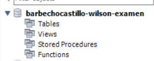
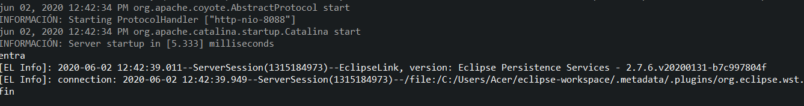
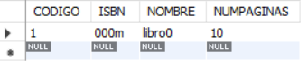

BarbechoCastillo-Wilson-Examen
==============================

**BASE DE DATOS**

La base de datos empieza vacía hasta ejecutar el servlet de libro.

Con esto podemos generar el diagrama y se realiza un insert por medio del
servlet.

